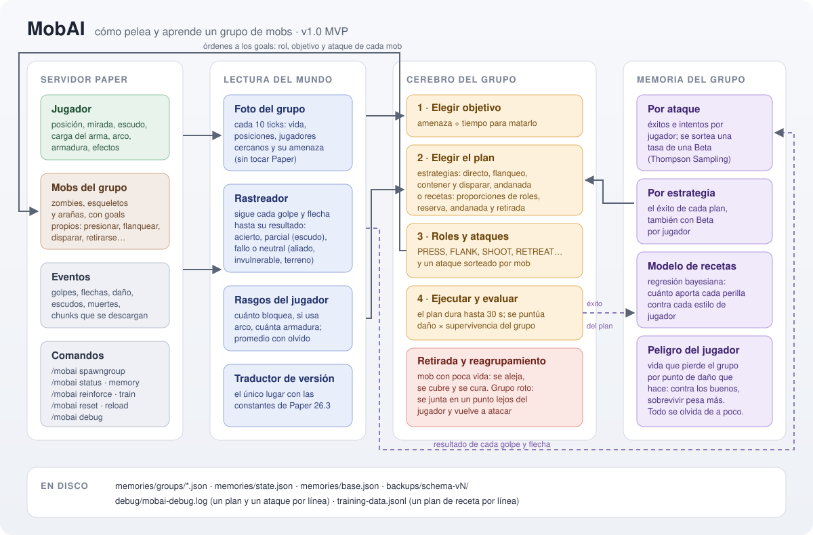
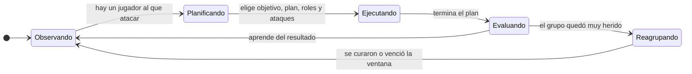

# MobAI

**Mobs hostiles que pelean en grupo, con roles, y que aprenden de cada jugador.**


MobAI es un plugin para servidores **Paper 26.3**. Los zombies, esqueletos y arañas dejan de pelear cada uno por su cuenta: se organizan en **grupos**, eligen a quién atacar, se reparten **roles** (presionar, flanquear, disparar, retirarse) y **recuerdan qué les funcionó contra cada jugador**. Si siempre bloqueás de frente, el grupo aprende a buscarte la espalda; si cargás golpes lentos, aprende a esquivarlos; si los destrozás, aprende a cuidarse más.

> **Versión 1.0 — MVP.** Es la primera versión completa: tres tipos de mob, grupos con cerebro, memoria por jugador y dos formas de planificar. Va a seguir creciendo (ver [Hoja de ruta](#hoja-de-ruta)).



---

## Índice

- [La idea en un minuto](#la-idea-en-un-minuto)
- [El ciclo de un grupo](#el-ciclo-de-un-grupo)
- [A quién ataca](#a-quién-ataca)
- [Cómo planifica: estrategias y recetas](#cómo-planifica-estrategias-y-recetas)
- [Roles](#roles)
- [Ataques disponibles](#ataques-disponibles)
- [Cómo sortea los ataques](#cómo-sortea-los-ataques)
- [Cómo mide si un plan salió bien](#cómo-mide-si-un-plan-salió-bien)
- [Retirada, curación y reagrupamiento](#retirada-curación-y-reagrupamiento)
- [Entrenamiento y base del server](#entrenamiento-y-base-del-server)
- [Comandos](#comandos)
- [Instalación](#instalación)
- [Configuración](#configuración)
- [Qué guarda en disco](#qué-guarda-en-disco)
- [Hoja de ruta](#hoja-de-ruta)
- [Documentación del proyecto](#documentación-del-proyecto)

---

## La idea en un minuto

- Cada **grupo** tiene un **cerebro** y una **memoria compartida**. Los mobs no deciden solos: el cerebro les da a cada uno un rol, un objetivo y un ataque.
- La memoria es **por jugador**: lo que el grupo aprendió peleando contra vos no se mezcla con lo que aprendió contra otro.
- Aprende con **probabilidades, no con reglas fijas**. Cada opción (un ataque, una estrategia) tiene una tasa de éxito estimada; antes de elegir, el grupo **sortea** un valor de cada una y se queda con el mejor. Lo que funciona se elige más; lo que no, se prueba cada tanto por si cambiaste.
- **Olvida de a poco.** Lo aprendido pierde la mitad de su peso cada 10 minutos de server prendido, así que si cambiás tu forma de pelear, el grupo se readapta.
- Todo lo que decide queda **explicado en un log**: qué plan eligió, por qué, y cómo le fue.

---

## El ciclo de un grupo

Cada 10 ticks (medio segundo) el cerebro de cada grupo mira una **foto** del mundo (vida y posición de sus mobs, jugadores cercanos, qué tienen en la mano, si bloquean) y decide.



| Estado | Qué hace el grupo |
| --- | --- |
| **Observando** | Espera a que haya un jugador al alcance. |
| **Planificando** | Elige a quién atacar y con qué plan. Dura una sola decisión. |
| **Ejecutando** | Pelea. Cada mob sigue su rol; los que quedan con poca vida se retiran a curarse y vuelven. |
| **Evaluando** | Puntúa el plan y guarda lo aprendido en la memoria. |
| **Reagrupando** | Si más de la mitad del grupo murió o se está retirando, todos se alejan, se juntan en un punto lejos del jugador, se curan y después vuelven a atacar. |

Un plan termina cuando pasa lo primero de esto: **el objetivo muere**, **se pierde** (lejos o sin que nadie lo vea por 10 s), **llega a 30 s**, o **el grupo se rompe**.

---

## A quién ataca

Si hay varios jugadores, el grupo calcula una **prioridad** para cada uno:

> **prioridad = amenaza ÷ tiempo para matarlo**

- **Amenaza:** cuánto daño le hizo ese jugador al grupo en los últimos 30 segundos.
- **Tiempo para matarlo:** su vida efectiva (armadura, encantamientos, absorción, resistencia, regeneración) más lo que tardan en llegar, dividido por el daño que el grupo espera hacerle con lo que sabe de él.
- Los **efectos de poción** cuentan: Debilidad baja la amenaza; Veneno y Wither acortan el tiempo; Lentitud hace que lleguen antes.
- El objetivo actual tiene un **bonus de compromiso del 20 %**, para que el grupo no cambie de víctima por diferencias mínimas.
- Las **arañas** van siempre al jugador más cercano, con el mismo bonus de compromiso.

---

## Cómo planifica: estrategias y recetas

MobAI trae **dos planificadores**, y se elige cuál usar en la configuración (`learning.planner`). Conviven para poder compararlos en el juego.

### Estrategias (por defecto)

Cuatro planes fijos. El grupo aprende cuál le rinde más contra cada jugador.

| Estrategia | Qué hace | Necesita |
| --- | --- | --- |
| **Ataque directo** | Todos van al objetivo por el camino más corto. | Nada (es la de respaldo). |
| **Flanqueo** | La mitad presiona de frente y la otra mitad rodea hasta quedar fuera de la vista del jugador y le pega por la espalda. | 3 mobs cuerpo a cuerpo. |
| **Contener y disparar** | Los zombies frenan al jugador a media distancia mientras los esqueletos disparan; las arañas flanquean. | 2 zombies y 2 esqueletos. |
| **Andanada** | Los cuerpo a cuerpo presionan; cada tanto se abren fuera del alcance del jugador, los esqueletos tiran todos juntos con la línea limpia, y vuelven a presionar. | 2 esqueletos y 2 cuerpo a cuerpo. |

### Recetas (aprendizaje fino)

En vez de cuatro planes fijos, el grupo arma una **receta** con perillas continuas:

- qué parte de los zombies **presiona**, **flanquea** o queda **de reserva**;
- qué parte de las arañas flanquea;
- si los esqueletos hacen **andanada**;
- **cuándo entra la reserva** (entre 1 y 20 segundos);
- **con cuánta vida se retira** cada mob (de 0 % a 50 %).

Un **modelo bayesiano** aprende cuánto aporta cada perilla contra cada **estilo de jugador** (cuánto bloquea, si usa arco, cuánta armadura lleva). Antes de cada plan sortea una versión del modelo y busca la mejor receta para ese sorteo, así el grupo varía cerca de lo que mejor le funciona en vez de repetir siempre lo mismo.

---

## Roles

| Rol | Qué hace el mob |
| --- | --- |
| `PRESS` | Va al objetivo y lo ataca. |
| `FLANK` | Sale de la vista del jugador por el camino más corto, sin meterse en su alcance, y le pega por la espalda. |
| `SHOOT` | Se ubica en un anillo a 20–30 bloques del jugador, buscando altura y un carril sin aliados, y dispara. |
| `RETREAT` | Se aleja, se cubre detrás de algo si puede, y se cura. |
| `FALL_BACK` | Se aparta justo fuera del alcance del jugador y espera (andanada y reserva). |
| `HOLD_FIRE` | El esqueleto se ubica y tensa el arco, sin soltar (andanada). |
| `VOLLEY` | El esqueleto suelta ya, junto con los demás (andanada). |

---

## Ataques disponibles

Cada mob elige **cómo** atacar con su propio sorteo, según lo que el grupo aprendió de vos.

### Zombie

| Ataque | Cómo es | Contra quién rinde |
| --- | --- | --- |
| **Golpe frontal** | Va directo y pega apenas te tiene al alcance. | Jugadores que no bloquean. |
| **Golpe de flanco** | Rodea fuera de tu vista (más de 120° de tu mirada) sin entrar en tu alcance, y recién ahí te pega por la espalda. | Jugadores que bloquean de frente: el escudo no cubre lo que no ve. |
| **Golpe paciente** | Se queda al alcance y pega cuando bajás el escudo o terminás tu propio golpe (espera hasta 3 s). | Jugadores que alternan bloquear y atacar. |
| **Golpe esquivo** | Calcula cuánto le falta a tu arma para cargar y cuánto tarda él, con su velocidad real, en salir de tu alcance. Pega si le da el tiempo; si no, se aparta justo antes de que cargues. Si te cubrís con el arma cargada, se corre al costado de tu mira y le pega al escudo. | Jugadores que cargan golpes fuertes y lentos. |

### Esqueleto

Antes de cada tiro el esqueleto **se planta, gira hacia vos y tensa el arco**. No dispara si tiene un aliado en el carril, contando dónde va a estar ese aliado cuando llegue la flecha.

| Ataque | Cómo es | Contra quién rinde |
| --- | --- | --- |
| **Disparo directo** | Apunta adonde estás. | Objetivos quietos. |
| **Disparo anticipado** | Apunta adonde vas a estar, con la física real de la flecha (arrastre y gravedad). | Jugadores que se mueven en línea recta. |
| **Disparo oportuno** | Espera con el arco tenso a que mires para otro lado o pelees con otro mob (hasta 3 s). | Jugadores que levantan el escudo hacia el esqueleto. |

### Araña

| Ataque | Cómo es |
| --- | --- |
| **Mordida** | Ataca al jugador más cercano. Si te muerde (sin escudo), te pone **Lentitud I por 3 s**, sin renovarla ni acumularla. |

### Qué cuenta como acierto

Cada golpe y cada flecha se siguen hasta su resultado:

| Resultado | Cuándo | Cómo cuenta |
| --- | --- | --- |
| **Acierto** | Hizo daño. | 1 |
| **Parcial** | Conectó pero lo bloqueaste con el escudo. | 0,5 (configurable) |
| **Fallo** | No conectó por algo tuyo: esquivaste, te alejaste, te subiste a un pilar. | 0 |
| **Neutral** | No conectó por otra cosa: le pegó a un aliado, eras invulnerable, el terreno lo trabó. | No cuenta |

---

## Cómo sortea los ataques

El grupo no elige "el mejor" siempre: **sortea**, para seguir probando lo que todavía no conoce bien. Usa **Thompson Sampling**:

1. Para cada ataque guarda, por jugador, sus **éxitos** y sus **intentos**.
2. Antes de atacar, de cada ataque sortea una tasa al azar de una distribución **Beta(éxitos + 1, fallos + 1)**:
   - con pocos datos, la Beta es ancha y el sorteo puede dar cualquier cosa (explora);
   - con muchos datos, la Beta es angosta y el sorteo da casi siempre lo mismo (explota lo que funciona).
3. El puntaje de cada ataque se multiplica por **(0,5 + tasa sorteada)**, con un techo entre 0,5 y 1,5 para que la memoria influya sin anular todo lo demás.
4. Gana el de puntaje más alto.

**Velocidad de aprendizaje.** Cada registro nuevo arranca con unos "intentos virtuales" al 50 %. Con la velocidad por defecto (1,0) son 2, y diez aciertos de diez llevan la tasa a 92 %; con 0 son 50 y aprende mucho más despacio.

**Olvido.** Éxitos e intentos se multiplican por ½ cada vida media (10 minutos por defecto). Un registro viejo vuelve a ser incierto, y el grupo vuelve a explorar.

Las **estrategias** se eligen igual, con una Beta por estrategia y por jugador. Las **recetas** usan la versión continua del mismo principio: un modelo lineal bayesiano del que se sortea un juego de pesos.

Además de Thompson Sampling hay otras dos políticas para comparar (`EXPLORE_FIRST` y `EPSILON_GREEDY`), y una de azar puro como control (`RANDOM`).

---

## Cómo mide si un plan salió bien

Cada plan se puntúa de 0 a 1 con tres medidas:

| Medida | Qué mide |
| --- | --- |
| **Daño** | Cuánto te sacó, sobre la mitad de tu vida máxima (o 1 si moriste). |
| **Rapidez** | Qué tan rápido te lo sacó, comparado con matarte en 30 s. |
| **Supervivencia** | La mitad por los aliados que siguen vivos y la mitad por la vida que conservó el grupo (curarse cuenta). |

> **éxito = ataque × (1 − peso + peso × supervivencia)**
> donde *ataque* combina daño y rapidez.

Así, **un plan que no te hace daño no vale nada aunque el grupo sobreviva entero**, y entre dos planes que te pegan lo mismo, gana el que pierde menos mobs.

**Jugadores muy buenos.** El grupo lleva, por jugador, cuánta vida pierde por cada punto de daño que le hace. Si lo estás destrozando, ese **peligro** sube y la supervivencia pasa a pesar más (de 0,2 a 0,6). Contra vos, el grupo aprende a cuidarse; contra un jugador común, sigue priorizando pegar.

---

## Retirada, curación y reagrupamiento

- **Retirada individual.** Un mob con poca vida (30 % por defecto, o el umbral de la receta) pasa a `RETREAT`: se aleja, busca algo detrás de lo cual esconderse y, sin jugadores a menos de 12 bloques, **se cura** al ritmo de Regeneración I. Con 60 % vuelve a su rol.
- **Retirada del grupo.** Si más de la mitad del grupo murió o se está retirando, el plan cierra y el grupo **se reagrupa**: elige un **punto de reunión** lejos del jugador y cada mob camina hasta ahí rodeándote por fuera de tu vista y de tu alcance. Cuando la mayoría se curó (o vence la ventana), vuelven a atacar juntos.
- **Ventana adaptativa.** Cuánto espera un grupo antes de volver se ajusta solo: si los grupos mueren reagrupándose, la acorta; si sobreviven, la alarga.

---

## Entrenamiento y base del server

Con el planificador de recetas, el server puede tener una **base**: un modelo compartido que deja a los mobs competentes desde la primera pelea contra cualquiera.

- Solo aprende de las peleas contra jugadores **en entrenamiento** (`/mobai train on <jugador>`). Un jugador que entra a pasear no la ensucia.
- Contra quien entrena, los mobs **exploran más** para aprender más rápido.
- Un jugador nuevo **arranca desde la base** y el grupo la va ajustando a su forma de pelear. La base pesa como mucho lo que valen 600 planes, así nunca tapa lo que el grupo aprende de vos.
- Cada plan de receta escribe una línea en `training-data.jsonl`, un conjunto de datos para recalibrar el modelo fuera del juego.

---

## Comandos

Todos requieren el permiso **`mobai.admin`**.

| Comando | Qué hace |
| --- | --- |
| `/mobai spawngroup [política]` | Crea un grupo de prueba a tu alrededor: 4 zombies, 3 esqueletos y 2 arañas, sin equipo. Sin política, usa la de la configuración (`THOMPSON_SAMPLING`). |
| `/mobai reinforce <grupo>` | Suma el set de prueba a un grupo existente, que **conserva su memoria**. Respeta el tamaño máximo. |
| `/mobai status [grupo]` | Estado de cada grupo: qué hace, cuántos miembros tiene, su estrategia y su objetivo. |
| `/mobai memory [jugador]` | Qué aprendió cada grupo de un jugador: peligro, estrategias y ataques de mejor a peor y, con recetas, las 5 mejores estimadas. |
| `/mobai train on\|off <jugador>` | Mete o saca a un jugador del entrenamiento. |
| `/mobai train status` | Cuántos planes tiene la base y quién está entrenando. |
| `/mobai reset [jugador]` | Borra lo aprendido, de todos o de un jugador. |
| `/mobai reload` | Recarga la configuración sin reiniciar. Si tiene un error, conserva la anterior. |
| `/mobai debug <grupo\|all> <OFF\|DECISIONS\|FULL>` | Activa la traza de decisiones de uno o de todos los grupos. |

---

## Instalación

**Requisitos:** servidor **Paper 26.3** con **Java 25**.

1. Copiá `MobAI-<versión>.jar` en la carpeta `plugins/` del server.
2. Iniciá el server. Se crean `plugins/MobAI/config.yml` y `plugins/MobAI/messages.yml`.
3. Probalo de noche: `/mobai spawngroup THOMPSON_SAMPLING`.

> En esta versión los grupos se crean con `/mobai spawngroup`. Los mobs naturales del mundo siguen con su IA vanilla (ver [Hoja de ruta](#hoja-de-ruta)).

**Al actualizar el plugin:** si el `config.yml` o el `messages.yml` de tu server no tienen una clave nueva, el plugin avisa en la consola y no arranca. Agregá la clave (el jar trae los valores por defecto) o borrá el archivo para que se regenere. **No uses `/reload` del server** para cambiar el jar: reiniciá.

**Compilar desde el código:**

```bash
./gradlew build
```

El jar queda en `build/libs/`. `./gradlew runServer` levanta un server de prueba con el plugin.

---

## Configuración

Todo lo que es balance está en `config.yml`, comentado en castellano. Las secciones:

| Sección | Qué ajusta |
| --- | --- |
| `group` | Tamaño máximo (12), cada cuánto decide (10 ticks), radio de detección. |
| `memory` | Vida media del olvido, velocidad de aprendizaje, cuánto vale un golpe bloqueado. |
| `selection` | Política por defecto y techo del efecto de la memoria. |
| `target` | Ventana de amenaza, bonus de compromiso, efecto de las pociones. |
| `plan` | Duración máxima, cuándo se da al objetivo por perdido, umbral de retirada. |
| `attack` | Esperas de los ataques pacientes, distancias de tiro, márgenes del flanqueo y del esquive. |
| `spider` | Nivel y duración de la Lentitud. |
| `retreat` | Vuelta a pelear, distancia segura para curarse, ventana y punto de reunión. |
| `volley` | Tiempos de cada fase de la andanada. |
| `success` | Pesos de daño, rapidez y supervivencia, y cómo se detecta a un jugador muy bueno. |
| `learning` | Planificador (`STRATEGIES` o `RECIPES`), números del modelo de recetas, límites de las perillas y peso de la base. |
| `persistence` · `debug` | Cada cuánto guarda (5 min, y al apagar) y el nivel de traza por defecto. |

---

## Qué guarda en disco

Dentro de `plugins/MobAI/`:

| Archivo | Qué tiene |
| --- | --- |
| `memories/groups/<grupo>.json` | Miembros y memoria de cada grupo: ataques, estrategias, peligro y modelos de recetas por jugador. |
| `memories/state.json` | Reloj del plugin, ventana de reagrupamiento y rasgos de cada jugador. |
| `memories/base.json` | La base del server (recetas). |
| `memories/backups/schema-vN/` | Copia automática antes de migrar memorias de una versión vieja. |
| `debug/mobai-debug.log` | Una línea por plan y por ataque, legible, para seguir qué aprendió y por qué. |
| `training-data.jsonl` | Una línea por plan de receta, para análisis fuera del juego. |

Los archivos se escriben de forma atómica. Uno dañado se aparta con la extensión `.corrupt` y el resto carga normal.

---

## Hoja de ruta

**1.0 — MVP (esta versión)**
- Zombies, esqueletos y arañas en grupos con cerebro y roles.
- 8 ataques y 4 estrategias, más el planificador de recetas.
- Memoria por jugador con olvido, Thompson Sampling y detección de jugadores muy buenos.
- Retirada, curación, cubierta, reagrupamiento con punto de reunión.
- Entrenamiento con base del server, comandos de prueba y persistencia en JSON.

**Lo que viene (fase 2 y después)**
- **Grupos naturales:** que los mobs del mundo se sumen a grupos por cercanía y que dos grupos cercanos se unifiquen sumando sus memorias.
- **Más mobs:** creepers y brujas.
- **Observadores** que aprenden mirando, y patrones por equipo de jugadores.
- **Métricas** de peleas en SQLite.
- Zombies que ponen y rompen bloques, composición adaptable del grupo.
- Validar en el juego, con varios testers, si las recetas superan a las estrategias.

---

## Documentación del proyecto

La documentación de diseño está en [`docs/`](docs/), en castellano:

| Documento | Para qué |
| --- | --- |
| [`requerimientos.md`](docs/requerimientos.md) | Qué tiene que hacer el sistema y las decisiones tomadas. |
| [`arquitectura.md`](docs/arquitectura.md) | Capas, flujos y el diseño del rastreador de ataques. |
| [`catalogo-mvp.md`](docs/catalogo-mvp.md) | Estrategias, ataques y valores iniciales del MVP. |
| [`diagramas.md`](docs/diagramas.md) | Los diagramas del sistema. |
| [`plan/cambios-tecnicos.md`](docs/plan/cambios-tecnicos.md) | Cada cambio de diseño, con su porqué. |

---

Hecho por **Nicolás Oroná**.
