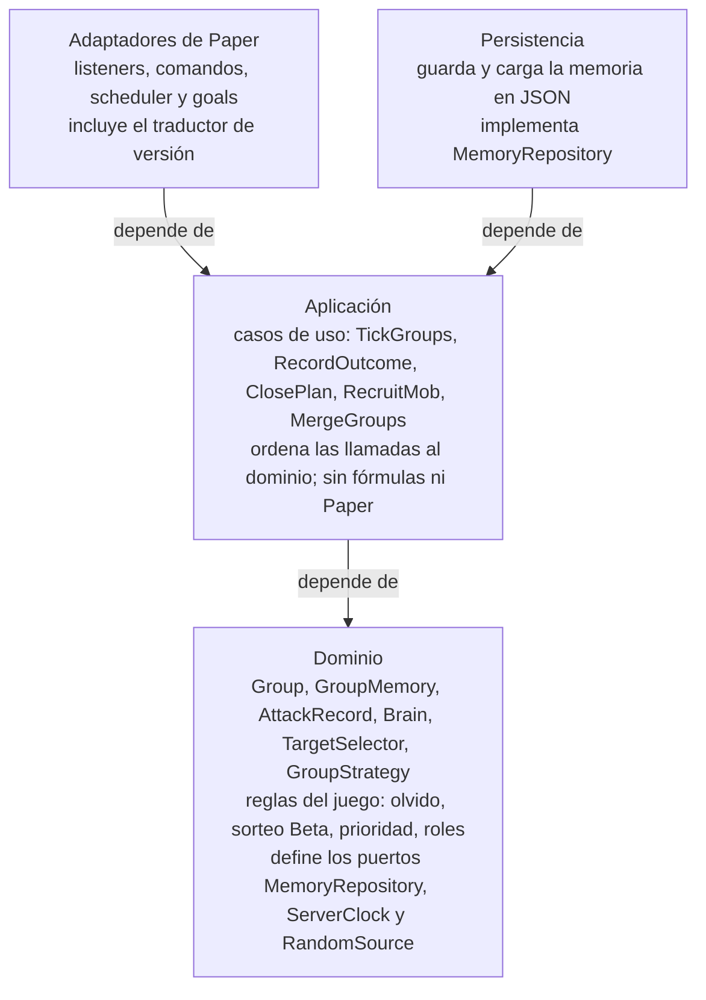
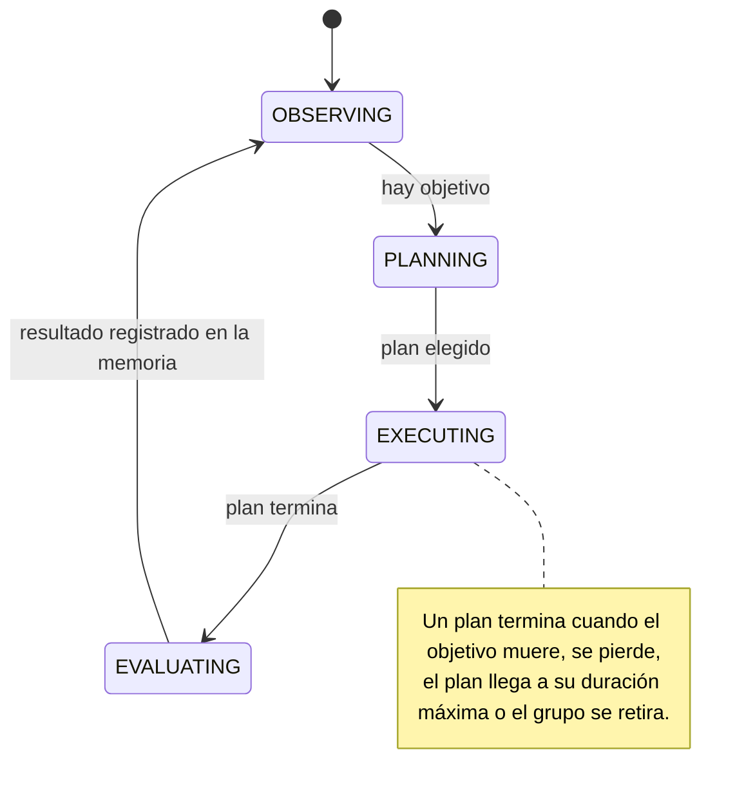
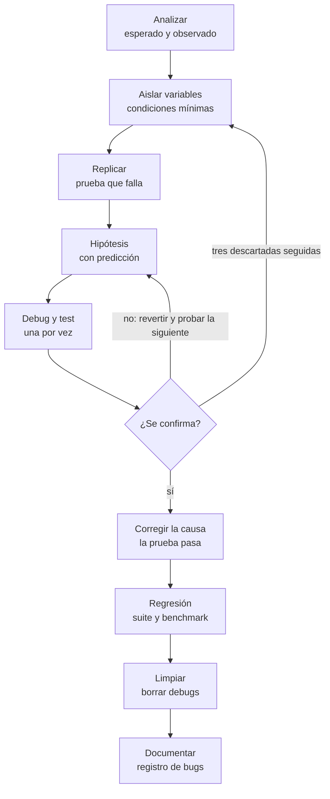

# Diagramas del diseño

Versiones en Mermaid de los diagramas del documento de diseño. GitHub los muestra como gráficos y se leen como texto.

## Plan por fases

```mermaid
flowchart LR
    subgraph M1["Mes 1 · MVP (semanas 1 a 4)"]
        S1["S1 · Entorno y primer goal"] --> S2["S2 · Grupo y 3 acciones"] --> S3["S3 · Memoria y objetivo"] --> S4["S4 · Pruebas y guardado"]
    end
    G1{{"Puerta: MVP probado<br/>memoria visible en pelea real"}}
    subgraph M2["Mes 2 · Grupo base (semanas 5 a 8)"]
        S5["S5 · Creepers y brujas"] --> S6["S6 · Ciclo de planes"] --> S7["S7 · Observadores, patrones"] --> S8["S8 · Pruebas con amigos"]
    end
    G2{{"Puerta: grupo base calibrado<br/>benchmark full diamante P4"}}
    subgraph POST["Posterior (sin fecha fija)"]
        P1["Zombies constructores"]
        P2["Illagers"]
        P3["Composición adaptable"]
        P4["Perfiles de composición"]
        P5["Líder-seguidores si hay lag"]
    end
    S4 --> G1 --> S5
    S8 --> G2 --> POST
```

## Capas del plugin

Las dependencias apuntan hacia el dominio, que no conoce Minecraft.

## Ciclo del grupo (máquina de estados)

## Proceso de resolución de bugs

