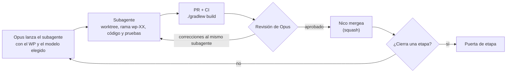

# Plan de implementación del MVP

**Parte 1 de 7 · Plan maestro** · Aprobado el 4 de octubre de 2026

Este plan convierte los documentos de `docs/` en paquetes de trabajo (WP) chicos y cerrados, para que los implemente un subagente, uno por WP, con pruebas que deciden si el resultado está bien. Opus escribe cada WP, lanza el subagente con el modelo que el WP necesita y revisa cada entrega; Nico aprueba, prueba en el server y mergea.

## 1. Cómo funciona

### Roles

| Rol | Quién | Qué hace |
| --- | --- | --- |
| Planificador, orquestador y revisor | Opus (el chat principal) | Escribe los WPs, lanza un subagente por WP con el modelo adecuado, revisa cada entrega contra su WP, le pide correcciones al mismo subagente y ajusta el plan cuando algo no cierra |
| Implementador | Un subagente por WP (Haiku, Sonnet u Opus, según la sección «Elección de modelo») | Implementa un solo WP en su propia copia del repo (worktree); no toca nada fuera de la lista de archivos del WP |
| Dueño | Nico | Aprueba el plan y cada etapa, corre las pruebas en el server y mergea |

Los subagentes no ven la conversación con Nico: solo reciben el WP y las reglas para agentes. Por eso cada WP tiene que bastarse solo.

### Elección de modelo

Opus elige el modelo de cada subagente con este criterio, y lo deja anotado en la tabla de la sección 4:

| Modelo | Cuándo | Ejemplos |
| --- | --- | --- |
| Haiku | Código mecánico, casi transcripción del WP: records, enums, configuración, cableado sin decisiones | Tipos base, estrategias |
| Sonnet | El caso general: lógica con reglas claras y pruebas definidas en el WP | Memoria, políticas, clasificador, casos de uso, adaptadores |
| Opus | Lógica delicada donde un error sutil arruina etapas posteriores, o terreno sin documentar | Spike de la API, cerebro |

Reglas de escalado:

- Si un subagente no pasa la revisión después de dos rondas de correcciones, el WP se relanza con el modelo siguiente.
- Si el problema es una ambigüedad del WP y no del modelo, se corrige el WP antes de relanzar.
- Los WPs que pueden ir en paralelo se lanzan a la vez, cada uno en su worktree.

### Qué tiene un WP

Cada WP es un archivo `docs/plan/wp/WP-XX-nombre.md` que se basta solo. El implementador no lee los seis documentos de diseño: el WP ya trae lo que necesita de ellos.

| Sección | Contenido |
| --- | --- |
| Objetivo | Una o dos líneas |
| Contexto a leer | Lista cerrada de archivos |
| Archivos | Lista cerrada de archivos a crear y a modificar, con ruta exacta |
| Especificación | Firmas Java exactas (paquete, clase, campos, constructor, métodos públicos con nombres de parámetros), reglas numeradas, casos borde y excepciones con su mensaje; pseudocódigo en los algoritmos delicados |
| Pruebas obligatorias | Nombre exacto de cada prueba, dado / cuando / entonces, valores esperados y tolerancia |
| Fuera de alcance | Lo que el WP no hace aunque parezca natural hacerlo |
| Aceptación y entrega | Build verde, commits, PR e informe final |

**Límites de tamaño**, para que un WP entre en el contexto de un modelo chico:

- Lectura total (reglas + WP + archivos de contexto): unas 1.500 líneas como máximo.
- Código nuevo: unas 400 líneas de producción y 600 de pruebas. Si un WP se pasa, se divide.

### Ciclo de un WP



### Tres niveles de control

1. **Automático, en cada PR:** compilación, pruebas, ArchUnit (capas y reglas de código) y Spotless, en GitHub Actions. Si falla, no se revisa.
2. **Revisión, en cada WP:** el diff contra el WP, los nombres, que no haya nada fuera de alcance, y que las pruebas muerdan: rompo a propósito la lógica clave y verifico que alguna prueba falle.
3. **Puerta de etapa:** al cerrar cada etapa, una verificación de punta a punta (tabla de números, simulación o guion en el server) antes de construir encima. Un error no pasa de etapa.

## 2. Alcance

Este plan detalla el MVP (mes 1) tal como lo definen la sección «Alcance» de `requerimientos.md` y `catalogo-mvp.md`. La fase 2 se planifica después de la puerta G1, con lo aprendido.

| Entra en el MVP | Queda para la fase 2 |
| --- | --- |
| Zombies, esqueletos y arañas | Creepers, brujas, illagers |
| Grupos creados con `/mobai spawngroup` | Crecimiento por acercamiento, unión de grupos y tiempo de vida (RF-01.3 a RF-01.5) |
| Cerebro con 3 estrategias y roles `PRESS`, `FLANK`, `SHOOT`, `RETREAT` | `CUT_OFF`, `SUPPORT`; foco o reparto entre objetivos |
| Los 7 ataques del catálogo y el rastreador con sus 8 reglas | Explosiones |
| Memoria por jugador con olvido y velocidad de aprendizaje | Observadores, patrones por equipo y memoria global (RF-07) |
| Las 4 políticas de selección (RF-12.1 a RF-12.3) | Métricas en SQLite (RF-12.4 y RF-12.5) |
| La memoria del grupo vive mientras viva un miembro | Escape y testigos (RF-08) |
| Persistencia en JSON, comandos de RF-10 y log de debug | |

## 3. Etapas y puertas

Cada etapa arranca cuando la anterior pasó su puerta. Las excepciones son el spike (E1), que corre en paralelo con E2 a E4, y los WPs de una misma etapa que no dependen entre sí.

| Etapa | WPs | Puerta de salida (quién la verifica) | Semana orientativa |
| --- | --- | --- | --- |
| E0 Andamiaje | WP-00 | CI verde y `./gradlew runServer` levanta Paper 26.3 con el plugin habilitado en el log (Nico) | S1 |
| E1 Spike en el server | WP-01 | Nico corre el guion del spike; Opus revisa `hallazgos-api.md` y recién ahí escribe los WPs de adaptadores | S1, en paralelo con E2 |
| E2 Dominio: aprendizaje | WP-02 a WP-05 | Valores de referencia en pruebas verdes: 1 de 1 → 67 %; 10 de 10 → 92 % con velocidad 1 y 58 % con velocidad 0; una vida media sin pelear → la mitad. Cobertura del dominio ≥ 80 % (Opus) | S1 |
| E3 Dominio: grupo y cerebro | WP-06 a WP-11 | La simulación en Java puro cumple los criterios de aprendizaje del MVP con la configuración del catálogo, o se acuerdan valores nuevos de velocidad y vida media (Nico + Opus) | S2 |
| E4 Aplicación y persistencia | WP-12 a WP-15 y WP-28 | Memoria de ida y vuelta por disco; todos los casos de uso probados con fakes; un incidente provocado a propósito se reproduce con `TraceReplay` (Opus) | S2 |
| E5 Esqueleto vivo | WP-16 a WP-21 y WP-29 | Guion en el server: spawngroup, status, golpes frontales registrados en la memoria y un reinicio que conserva la memoria (Nico) | S3 |
| E6 Comportamiento completo | WP-22 a WP-26 | Guion en el server: cada ataque y las reglas del rastreador que pide el catálogo (Nico) | S4 |
| E7 Validación | WP-27 | Puerta G1: definición de terminado del catálogo, con evidencia (Nico + Opus) | S4 |

La simulación de E3 también cierra una decisión abierta de `requerimientos.md`: los valores por defecto de la velocidad de aprendizaje y de la vida media del olvido, calibrados juntos.

## 4. Paquetes de trabajo

| WP | Título | Depende de | Ejecuta | Qué deja |
| --- | --- | --- | --- | --- |
| WP-00 | Andamiaje, reglas automáticas y CI | — | Sonnet | Proyecto Gradle, `plugin.yml`, `MobAiPlugin` vacío, `ArchitectureTest`, CI |
| WP-01 | Spike: un goal propio en un zombie | WP-00 | Opus (chat principal) + Nico | `docs/plan/hallazgos-api.md`; el código queda en una rama sin mergear |
| WP-02 | Tipos base, puertos y configuración | WP-00 | Haiku | `domain.shared`, puertos de reloj y azar, `domain.settings`, fakes de prueba |
| WP-03 | Memoria con olvido | WP-02 | Sonnet | `AttackRecord`, `LearningPrior`, `SuccessEstimate`, `GroupMemory` |
| WP-04 | Sorteo Beta y políticas de selección | WP-03 | Sonnet | `BetaSampler`, las 4 políticas y su fábrica |
| WP-05 | Clasificador de ataques | WP-02 | Sonnet | `AttackFacts`, `AttackOutcome`, `AttackClassifier` con las 8 reglas |
| WP-06 | Fotos, amenaza y geometría | Puerta E2 | Sonnet | Fotos, `ThreatLedger`, `CombatGeometry`, builders de prueba |
| WP-07 | Selección de objetivo | WP-06 | Sonnet | `KillTimeEstimator`, `TargetSelector`, `SpiderTargetRule` |
| WP-08 | Grupo, plan y eventos | WP-06 | Sonnet | `Group`, `Member`, `Plan`, decisiones y eventos del dominio |
| WP-09 | Estrategias | WP-08 | Haiku | Las 3 estrategias y `StrategyCatalog` |
| WP-10 | Cerebro | WP-07, WP-09 | Opus | `Brain`, `PlanEndDetector`, `AttackSuggester` |
| WP-11 | Simulación de aprendizaje | WP-10 | Sonnet | Prueba de aceptación en Java puro e informe de calibración |
| WP-12 | Grupos activos y membresía | Puerta E3 | Sonnet | `ActiveGroups`, `SettingsHolder`, `RecruitMob`, `RemoveMember`, `DisbandGroup` |
| WP-13 | Casos de uso de combate | WP-12 | Sonnet | `TickGroups`, `RecordOutcome`, `RecordDamageTaken`, `RecordPlayerDeath`, `ClosePlan` |
| WP-14 | Puerto de persistencia y JSON | Puerta E3 | Sonnet | `MemoryRepository`, datos guardados, `JsonMemoryRepository` |
| WP-15 | Guardar, cargar, resetear y consultar | WP-13, WP-14 | Sonnet | `SaveMemories`, `LoadMemories`, `ResetMemories` y las consultas |
| WP-16 | Runtime, configuración y mensajes | Puertas E1 y E4 | Sonnet | `ServerTickCounter`, `JdkRandomSource`, `config.yml`, `ConfigLoader`, `messages.yml` |
| WP-17 | Traductor de versión y fotos | Puertas E1 y E4 | Sonnet | `VersionTranslator`, `SnapshotFactory` |
| WP-18 | Rastreador cuerpo a cuerpo | WP-17 | Sonnet | `AttackTracker`, `DamageListener`, `DeathListener` |
| WP-19 | Roles, goals y golpe frontal | WP-18 | Sonnet | `RoleRegistry`, `GoalInstaller`, `PressGoal`, `MeleeAttacker`, listeners de carga y de objetivo |
| WP-20 | Scheduler, guardado y arranque | WP-16, WP-19 | Sonnet | `DecisionScheduler`, `DecisionApplier`, `PersistenceScheduler`, `MobAiPlugin` armado |
| WP-21 | Comandos y log de debug | WP-20 | Sonnet | `/mobai spawngroup`, `status`, `reset`, `reload`; `DebugLog` |
| WP-22 | Flanqueo y retirada | Puerta E5 | Sonnet | `FlankGoal`, `RetreatGoal` |
| WP-23 | Golpes de flanco y paciente | WP-22 | Sonnet | Dos estilos más en `MeleeAttacker` |
| WP-24 | Esqueletos y proyectiles | WP-23 | Sonnet | `ShootGoal`, `BowShooter`, rastreo de flechas |
| WP-25 | Arañas | WP-24 | Sonnet | Mordida con lentitud |
| WP-26 | Consulta de memoria y métricas | WP-25 | Sonnet | `/mobai memory` y líneas de métricas para contar |
| WP-27 | Validación del MVP | Puerta E6 | Nico + Opus | Sesiones de prueba, medición con Spark e informe para G1 |
| WP-28 | Trazas: incidentes y reproducción | WP-15 | Sonnet | `IncidentReport`, su JSON y `TraceReplay`; cierra la etapa E4 |
| WP-29 | Trazas en el server | WP-21 | Sonnet | `TraceWriter`, `FlightRecorder`, `IncidentWriter`, `RecordingRandomSource`, `/mobai debug`; cierra la etapa E5 |

```mermaid
flowchart LR
    W00["WP-00"] --> W01["WP-01 spike"] --> P1{{"Puerta E1"}}
    W00 --> W02["WP-02"]
    W02 --> W03["WP-03"] --> W04["WP-04"]
    W02 --> W05["WP-05"]
    W04 & W05 --> P2{{"Puerta E2"}}
    P2 --> W06["WP-06"]
    W06 --> W07["WP-07"]
    W06 --> W08["WP-08"] --> W09["WP-09"]
    W07 & W09 --> W10["WP-10"] --> W11["WP-11"] --> P3{{"Puerta E3"}}
    P3 --> W12["WP-12"] --> W13["WP-13"]
    P3 --> W14["WP-14"]
    W13 & W14 --> W15["WP-15"] --> W28["WP-28"] --> P4{{"Puerta E4"}}
    P1 & P4 --> W16["WP-16"]
    P1 & P4 --> W17["WP-17"] --> W18["WP-18"] --> W19["WP-19"]
    W16 & W19 --> W20["WP-20"] --> W21["WP-21"] --> W29["WP-29"] --> P5{{"Puerta E5"}}
    P5 --> W22["WP-22"] --> W23["WP-23"] --> W24["WP-24"] --> W25["WP-25"] --> W26["WP-26"] --> P6{{"Puerta E6"}}
    P6 --> W27["WP-27"] --> G1{{"Puerta G1"}}
```



**En paralelo** (subagentes simultáneos, cada uno en su worktree): WP-01 con todo E2 a E4; WP-03 y WP-05; WP-07 y WP-08; WP-12 y WP-14; WP-16 y WP-17. E6 va en fila porque sus WPs tocan los mismos archivos.

**Archivos que tocan varios WPs.** Cada WP los lista en su sección «Archivos»; el orden evita conflictos:

| Archivo | Lo crea | Lo modifican, en este orden |
| --- | --- | --- |
| `bootstrap/MobAiPlugin.java` | WP-00 | WP-20, WP-21, WP-22 a WP-26 |
| `adapter/goal/GoalInstaller.java` | WP-19 | WP-22, WP-24 |
| `adapter/goal/MeleeAttacker.java` | WP-19 | WP-23, WP-25 |
| `adapter/tracker/AttackTracker.java` | WP-18 | WP-24 |
| `adapter/command/MobAiCommand.java` | WP-21 | WP-26 |
| `config.yml`, `messages.yml` | WP-16 | WP-21 a WP-26, solo si el WP lo indica |

## 5. Mapa del código

Paquete base: `io.github.nicodoou.mobai`. Este mapa es el contrato de nombres: ningún WP crea una clase que no esté acá sin que antes se actualice el mapa. Los nombres de adaptadores (WP-16 en adelante) se confirman después del spike.

```text
io.github.nicodoou.mobai
├── domain                            sin Paper, sin archivos, sin reloj del sistema
│   ├── shared      MobId, PlayerId, GroupId, StrategyId, MobKind, Attack, PlanId (WP-08),
│   │               EffectKind, Vec3, MinecraftConstants                               WP-02
│   ├── port        ServerClock, RandomSource                                          WP-02
│   │               GroupIdSource                                                      WP-12
│   │               MemoryRepository, MemoryLoad, StoredMemories, StoredState,
│   │               StoredGroup, StoredAttackRecord, StoredStrategyRecord              WP-14
│   ├── settings    MobAiSettings, GroupSettings, MemorySettings, SelectionSettings,
│   │               TargetSettings, PlanSettings, AttackSettings, SpiderSettings,
│   │               PersistenceSettings, DebugSettings                                 WP-02
│   ├── memory      AttackRecord, LearningPrior, SuccessEstimate, GroupMemory           WP-03
│   ├── selection   SelectionPolicyType                                                WP-02
│   │               BetaSampler, MemoryMultiplier, SelectionCandidate, SelectionPolicy,
│   │               ThompsonSamplingPolicy, ExploreFirstPolicy, EpsilonGreedyPolicy,
│   │               RandomPolicy, SelectionPolicyFactory                               WP-04
│   ├── attack      AttackFacts, ProjectileContact, AttackOutcome, NeutralCause,
│   │               AttackClassifier                                                   WP-05
│   ├── snapshot    SnapshotChecks, PlayerSnapshot, MobSnapshot, GroupSnapshot         WP-06
│   ├── threat      ThreatLedger                                                       WP-06
│   ├── geometry    PlayerPose, CombatGeometry                                         WP-06
│   ├── target      KillTimeEstimate, KillTimeEstimator, TargetQuery, TargetScore,
│   │               TargetSelection, TargetSelector, SpiderTargetRule                  WP-07
│   ├── group       Member, Role, GroupState, Plan, PlanStart, PlanEndReason,
│   │               GroupKnowledge, Group                                              WP-08
│   │               GroupRoster, PlanLifecycle, PendingEvents                          WP-08B
│   ├── decision    ClosedPlan                                                         WP-08
│   │               RoleAssignment, GroupDecision, StrategyCheck, AttackChoice,
│   │               DecisionTrace, BrainResult                                         WP-10A
│   ├── event       DomainEvent, PlanClosed, LeaderDied, DomainEventPublisher          WP-08
│   ├── strategy    GroupStrategy, DirectAssaultStrategy, FlankStrategy,
│   │               PinAndShootStrategy, GroupComposition, StrategyCatalog             WP-09
│   └── brain       PlanEndDetector, RetreatRule, RegroupRule, RegroupWindow,
│                   AttackContext, AttackSuggester                                     WP-10A
│                   Brain, BrainParts                                                  WP-10B
├── application     SettingsHolder, ActiveGroups, RecruitMob, RecruitRequest,
│                   RecruitResult, RemovalOutcome, RemoveMember, DisbandGroup          WP-12
│                   TickGroups, RecordOutcome, RecordDamageTaken, RecordPlayerDeath,
│                   ClosePlan, AttackResolution, DamageTaken, RemovalCause,
│                   GroupEvents                                                        WP-13
│                   StoredMemoriesMapper, SaveMemories, LoadMemories, ResetMemories,
│                   DescribeGroup, GroupStatusView, DescribePlayerMemory,
│                   PlayerMemoryView, GuardedMemoryRepository, LoadReport              WP-15
├── persistence     JsonMemoryRepository, MemoryFiles, AtomicFileWriter,
│                   SchemaMigrator, GroupFileMapper, GroupFile, StateFile,
│                   MemberEntry, RecordEntry                                           WP-14
├── adapter
│   ├── runtime     ServerTickCounter, JdkRandomSource                                 WP-16
│   ├── config      ConfigLoader, Messages        (+ config.yml y messages.yml)        WP-16
│   ├── translate   VersionTranslator                                                  WP-17
│   ├── snapshot    SnapshotFactory                                                    WP-17
│   ├── tracker     AttackTracker, OpenAttempt                         WP-18 (flechas: WP-24)
│   ├── listener    DamageListener, DeathListener                                      WP-18
│   │               EntityLifecycleListener, TargetListener                            WP-19
│   │               ProjectileListener                                                 WP-24
│   ├── goal        RoleRegistry, GoalInstaller, PressGoal, MeleeAttacker              WP-19
│   │               FlankGoal, RetreatGoal                                             WP-22
│   │               ShootGoal, BowShooter                                              WP-24
│   ├── scheduler   DecisionScheduler, DecisionApplier, PersistenceScheduler           WP-20
│   ├── command     MobAiCommand                                      WP-21 (memory: WP-26)
│   └── debug       DebugLog                                                           WP-21
└── bootstrap       MobAiPlugin                                     WP-00 vacío, WP-20 armado
```

Las pruebas espejan esos paquetes en `src/test/java`. Los fakes y builders compartidos viven en `testsupport`: `FakeServerClock`, `SeededRandomSource` y `TestSettings` (WP-02); `PlayerSnapshotBuilder`, `MobSnapshotBuilder` y `GroupSnapshotBuilder` (WP-06); `InMemoryMemoryRepository` (WP-14). `ArchitectureTest` (WP-00) vive en el paquete base.

**Reglas de dependencia** (las verifica ArchUnit desde WP-00):

| Paquete | Puede depender de |
| --- | --- |
| `domain` | Solo el JDK (`java.*`) |
| `application` | `domain` |
| `persistence` | `domain` y Gson |
| `adapter` | `application`, `domain` y Paper; nunca `persistence` |
| `bootstrap` | Todo: es donde se arma el plugin |

## 6. Conceptos nuevos para la tabla de nombres

Estos conceptos no están en la tabla «Nombres en el código» de `arquitectura.md`. Si se aprueban, los agrego ahí antes del primer WP que los use.

| Concepto | Nombre en el código | Capa |
| --- | --- | --- |
| Ataque (los 7 del catálogo) | `Attack` | Dominio |
| Tipo de mob, efecto de poción | `MobKind`, `EffectKind` | Dominio |
| Identificadores | `MobId`, `PlayerId`, `GroupId`, `StrategyId` | Dominio |
| Vector o posición | `Vec3` | Dominio |
| Configuración | `MobAiSettings` (un record por sección) | Dominio |
| Intentos virtuales de la velocidad de aprendizaje | `LearningPrior` | Dominio |
| Estimación de éxito (los parámetros de la Beta) | `SuccessEstimate` | Dominio |
| Sorteo desde la Beta | `BetaSampler` | Dominio |
| Opción a elegir, con su puntaje base | `SelectionCandidate` | Dominio |
| Causa de un resultado neutral | `NeutralCause` | Dominio |
| Registro de amenaza | `ThreatLedger` | Dominio |
| Geometría de combate (arco del escudo, punto de flanqueo, tiro anticipado) | `CombatGeometry` | Dominio |
| Tiempo para matarlo | `KillTimeEstimator` | Dominio |
| Regla de objetivo de la araña | `SpiderTargetRule` | Dominio |
| Plan en curso | `Plan` | Dominio |
| Orden para un mob (rol, objetivo y ataque sugerido) | `RoleAssignment` | Entre capas |
| Plan cerrado | `ClosedPlan` | Entre capas |
| Grupos activos e índice mob → grupo | `ActiveGroups` | Aplicación |
| Configuración vigente | `SettingsHolder` | Aplicación |
| Casos de uso nuevos | `RemoveMember`, `RecordDamageTaken`, `RecordPlayerDeath`, `ResetMemories`, `DescribeGroup`, `DescribePlayerMemory` | Aplicación |
| Datos guardados | `StoredMemories`, `StoredGroup`, `StoredMember`, `StoredRecord` | Dominio (puerto) |
| Scheduler de decisión, aplicador de decisiones | `DecisionScheduler`, `DecisionApplier` | Adaptadores |
| Armado de fotos, instalador de goals | `SnapshotFactory`, `GoalInstaller` | Adaptadores |

## 7. Decisiones para aprobar

Los documentos dejan estos puntos abiertos, o los resuelven de una forma que no alcanza para un modelo chico. Cada decisión se puede aprobar o cambiar por su número.

### Producto y orden

- **D1. Nombres.** Plugin `MobAI`, paquete `io.github.nicodoou.mobai`, comando `/mobai` con `spawngroup [política]`, `status [grupo]`, `memory <jugador>`, `reset [jugador]` y `reload`, y permiso `mobai.admin`.
- **D2. Grupos del MVP.** Solo nacen con `/mobai spawngroup`. Sus mobs no despawnean: si despawnearan, se perdería la memoria y no se podría probar el reinicio. Sin jugadores cerca, el grupo se queda quieto, porque se le quitan los goals vanilla de movimiento.
- **D3. Orden de construcción.** Primero el dominio, después la aplicación y la persistencia, y al final los adaptadores, con el spike en paralelo. El plan semanal S1 a S4 iba por funcionalidad; el contenido del mes y la puerta G1 no cambian. El dominio puro se construye y se prueba más rápido con agentes, y la simulación de E3 valida el aprendizaje antes de tocar Minecraft.

### Dominio

- **D4. Los intentos virtuales se suman al leer, no al crear.** El registro guarda solo datos reales, con olvido. Los intentos virtuales (`50 − 48 × velocidad`, mitad aciertos y mitad fallos) se suman al calcular la Beta. Para un registro nuevo da exactamente lo mismo que dice RF-06. La diferencia es que el olvido vuelve hacia el 50 % inicial, en vez de llevar la Beta a (0, 0), y que recargar la velocidad afecta también a los registros existentes.
- **D5. El objetivo queda fijo durante el plan.** Se elige al planificar, con el bonus de compromiso para el objetivo del plan anterior, y no cambia hasta que el plan termina (RF-03.7: un objetivo principal por plan). La excepción son las arañas: cada una sigue al jugador más cercano, con compromiso (RF-02).
- **D6. El objetivo no se sortea.** Se elige el de mayor prioridad, sin pasar por la política de selección. La memoria igual influye, a través del daño esperado. Si se sorteara, el multiplicador de 0,5 a 1,5 haría cambiar de objetivo al azar y anularía el compromiso. En el MVP, RF-12 se aplica a ataques y estrategias; para objetivos se retoma en la fase 2, con «foco o reparto».
- **D7. Fórmula de prioridad.**
  - Tiempo para matarlo = llegada + vida efectiva ÷ daño neto por segundo. RF-04.3 suma vida y tiempo, que no tienen la misma unidad.
  - La amenaza tiene un piso de 1, para que un jugador que todavía no pegó no tenga prioridad 0.
  - Efectos: resistencia y absorción suben la vida efectiva; regeneración baja el daño neto; veneno y wither lo suben; debilidad multiplica la amenaza; lentitud baja el tiempo de llegada.
  - Las fórmulas exactas, con constantes de Minecraft, van en WP-07.
- **D8. Los roles quedan fijos durante el plan.**
  - Se reparten al empezar el plan. En cada decisión solo cambia a `RETREAT` quien tenga 30 % de vida o menos.
  - En FLANK, la mitad de los mobs cuerpo a cuerpo (redondeada para abajo) flanquea, con las arañas primero.
  - En PIN_AND_SHOOT, el «PRESS con distancia corta» de los zombies queda como `PRESS` en el MVP.
- **D9. Ataque sugerido y enganche.** El cerebro sugiere un ataque para cada mob en cada decisión. El goal toma la sugerencia al empezar un ataque y la sostiene hasta ejecutarlo o hasta que vence la espera. Así el mob no cambia de idea cada medio segundo, y solo se registran los ataques ejecutados.
- **D10. Transiciones dentro de una decisión.** Si hay objetivo, OBSERVING → PLANNING → EXECUTING pasa en la misma decisión. Cuando un plan termina, EXECUTING → EVALUATING → OBSERVING también pasa en la misma decisión, y el plan siguiente arranca en la decisión siguiente, 10 ticks después.
- **D11. Causas neutrales.**
  - Las cinco reglas neutrales del rastreador son los valores de `NeutralCause`: `TARGET_INVALID`, `DAMAGE_CANCELLED`, `TARGET_INVULNERABLE`, `ALLY_HIT` e `INTERRUPTED`.
  - El daño ambiental que recibe el mob durante el intento cuenta como `INTERRUPTED` (RF-05.5).
  - Un cambio de objetivo, o la muerte o descarga del mob, cancelan el intento sin registrarlo.
- **D12. Daño del plan y muerte del objetivo.** El daño del plan es la suma del daño final de nuestros ataques sobre el objetivo. La muerte del objetivo se detecta por evento, no porque falte en la foto, para no confundirla con «objetivo perdido».
- **D13. La geometría vive en el dominio.** El arco frontal del escudo, el punto de flanqueo y el tiro anticipado son funciones puras en `CombatGeometry`, probadas con JUnit; los adaptadores solo las usan. Es la lógica más fácil de escribir mal y la más difícil de ver en el server.

### Aplicación y persistencia

- **D14. Se guarda la lista de miembros.** El archivo de cada grupo guarda su memoria, su política y sus miembros (UUID, tipo y orden de ingreso), sin estado de entidad. Sin la lista de miembros, después de un reinicio la memoria no sabe a qué mobs volver, y un grupo con mobs en chunks descargados se disolvería por error. `arquitectura.md` dice que los grupos se reconstruyen por cercanía, pero ese mecanismo es de la fase 2.
- **D15. Un solo índice mob → grupo.** Vive en `ActiveGroups` (aplicación), no en los adaptadores, para que haya una sola fuente de verdad. En los adaptadores queda solo `RoleRegistry`.
- **D16. Cada guardado reemplaza todo.** Cada ciclo escribe los grupos vivos y borra los archivos de los grupos disueltos, siempre en otro hilo. Así el hilo principal no toca el disco salvo al apagar. Si al cargar aparece un archivo corrupto, se renombra a `.corrupt` y se avisa en la consola.
- **D17. Recarga de configuración.** Los servicios del dominio reciben un `Supplier` de su sección de configuración, y `SettingsHolder` reemplaza el record entero con `/mobai reload`. Así nadie lee valores viejos ni a medias.
- **D18. IDs de grupo.** Son UUID; los comandos y los logs muestran los primeros 8 caracteres.
- **D19. Valores de configuración nuevos.** Ninguno está en el catálogo y todos se pueden cambiar en `config.yml`:

  | Parámetro | Valor inicial |
  | --- | --- |
  | Radio de detección de jugadores | 24 bloques |
  | Piso de amenaza | 1 |
  | Velocidad de acercamiento (para el tiempo de llegada) | 3 bloques/s |
  | Amenaza con debilidad | ×0,5 por nivel |
  | Épsilon (epsilon-greedy) | 0,1 |
  | Intentos al azar (explorar primero) | 10 |
  | Distancia del punto de flanqueo | 3 bloques |
  | Distancia de retirada | 16 bloques |
  | Fracción de vida para éxito completo | 0,5 (sale de la fórmula del catálogo) |

### Herramientas y proceso

- **D20. Herramientas.**
  - Gradle con Kotlin DSL y wrapper.
  - JDK 25 descargado por el propio Gradle: en tu PC hay Java 21 y no hace falta instalar nada.
  - run-paper para `runServer`.
  - Spotless con google-java-format.
  - JUnit 5 y AssertJ (AssertJ no está en los documentos: hace las comparaciones con tolerancia más claras).
  - ArchUnit, JaCoCo a pedido, y Gson, que ya trae Paper.
  - Sin Mockito ni MockBukkit: los puertos se prueban con fakes y los adaptadores, en el server.
- **D21. ArchUnit más estricto que los documentos.** Ataja errores típicos de modelos chicos:
  - campos estáticos siempre `final`;
  - prohibidos `java.util.Random`, `Math.random`, `System.currentTimeMillis`, `java.io` y `java.nio.file` en dominio y aplicación;
  - prohibidas las clases `*Manager`, `*Helper` y `*Utils`;
  - solo `VersionTranslator` lee constantes de Paper (`EntityType`, `Material`, `PotionEffectType`, `Attribute`, `Enchantment`, `VanillaGoal`).
- **D22. CI y ramas.** GitHub Actions corre `./gradlew build` en cada PR (en un repo privado usa los minutos gratis de la cuenta). Cada subagente trabaja en su worktree, con una rama y un PR por WP, y squash merge: queda un commit por WP en `main`.
- **D23. El spike lo hace el chat principal.** WP-01 define los datos de API de los que dependen los once WPs de adaptadores (WP-16 a WP-26), así que lo hago yo directamente, sin subagente, con vos probando en el server. Su código no se mergea; queda `hallazgos-api.md`.
- **D24. Ajuste a `CLAUDE.md`.** Agregar «Si estás implementando un WP de `docs/plan/`, leé solo lo que indica el WP», para que los implementadores no gasten contexto en los seis documentos.
- **D25. Retirada táctica** (Nico, 5 de octubre). `RETREAT` con 30 % o menos y vuelta al rol inicial con 60 % o más; mientras se retira y sin jugadores a menos de 12 bloques, el plugin cura 1 punto cada 50 ticks (ritmo de Regeneración I), sin efecto visible, porque los no-muertos son inmunes a Regeneración y Veneno.
- **D26. Reagrupamiento** (Nico, 5 de octubre). Un plan cerrado por `GROUP_RETREATED` lleva al estado nuevo `REGROUPING`: todos se retiran y se curan hasta que más de la mitad tiene 60 % o vence la ventana.
- **D27. Ventana de reagrupamiento global y adaptativa** (Nico, 5 de octubre). 600 ticks al empezar, entre 200 y 1.200; −50 si un grupo muere entero reagrupándose, +50 si termina vivo. Una sola para todo el server, guardada con las memorias.
- **D28. `Group` dividido** (5 de octubre). Por la regla de métodos públicos, `Group` delega en `GroupRoster` (miembros, líder, arañas) y `PlanLifecycle` (estados, plan, compromiso), que comparten `PendingEvents` (WP-08B).
- **D29. Rol de flanqueo y ataque** (CT-08, 5 de octubre). El zombie con rol `FLANK` usa siempre `zombie.flank_strike`; los tres golpes se eligen solo con rol `PRESS`.
- **D30. Calibración** (CT-09, puerta E3, 5 de octubre). Velocidad de aprendizaje 1,0 y vida media 12.000 ticks.
- **D31. Ids de grupo por puerto** (CT-10, WP-12). `GroupIdSource` da los ids de grupo nuevos, sin gastar tiradas de `RandomSource`.
- **D32. Resultado del plan por evento** (CT-11, WP-13). Todo plan cerrado llega a la memoria por `PlanClosed` → `ClosePlan`; `RemoveMember` distingue muerte de despawn para la ventana de reagrupamiento.

## 8. Partes siguientes

| Parte | Contenido | Cuándo |
| --- | --- | --- |
| 2 | Reglas para agentes, plantilla de WP, prompt de lanzamiento de subagentes, WP-00 y WP-01 | Después de aprobar esta parte |
| 3 | WP-02 a WP-05 (dominio: aprendizaje) | Después de la parte 2 |
| 4 | WP-06 a WP-11 (dominio: grupo y cerebro) | Después de la parte 3 |
| 5 | WP-12 a WP-15 (aplicación y persistencia) | Después de la parte 4 |
| 6 | WP-16 a WP-21 (esqueleto vivo) | Después de la puerta E1, porque depende de los hallazgos del spike |
| 7 | WP-22 a WP-27 (comportamiento completo y validación) | Después de la puerta E5 |

Las partes 2 a 5 se pueden escribir mientras los subagentes avanzan con lo ya aprobado.
